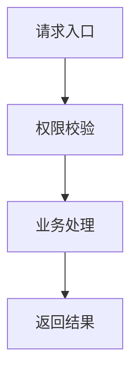

# Design: <change-id>

## 方案概览

用一段话说明技术实现路线。

## 现状分析

- 相关模块：
- 相关类/接口：
- 当前数据结构：
- 当前配置：

## 详细设计

### 接口设计

| Method | Path | 变化 | 兼容策略 |
|---|---|---|---|
| | | | |

### 状态与数据设计

| 页面状态/API 数据 | 变化 | 兼容方式 | 回滚方式 |
|---|---|---|---|
| | | | |

### 业务流程

### 运行时影响

- 路由：
- 登录态：
- API client：
- 样式/响应式：
- 构建/部署：

## 兼容性

- 老接口是否保留：
- 老数据是否可读：
- 前端是否需要同步：
- 灰度期间新旧版本是否兼容：

## 测试计划

- 单元测试：
- 集成测试：
- 接口 smoke：
- 回归范围：

## 发布与回滚

- 发布步骤：
- 验证命令：
- 回滚步骤：
